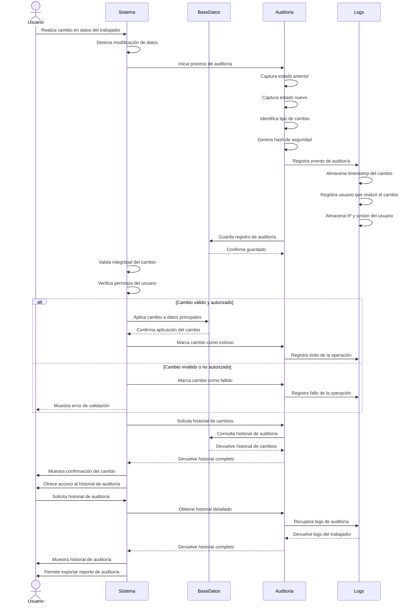

# Diagrama de Secuencia - Auditoría de Cambios

## Descripción del Proceso

### 1. **Detección de Cambios**
- Sistema detecta automáticamente modificaciones
- Inicio inmediato del proceso de auditoría
- Captura de estado anterior y nuevo

### 2. **Registro de Auditoría**
- **Timestamp**: Fecha y hora exacta del cambio
- **Usuario**: Identificación del usuario que realizó el cambio
- **IP y sesión**: Información de seguridad
- **Tipo de cambio**: Clasificación del tipo de modificación

### 3. **Generación de Hash de Seguridad**
- **Hash del cambio**: Identificación única de la modificación
- **Integridad**: Verificación de que el cambio no fue alterado
- **No repudio**: Garantía de que el cambio fue realizado

### 4. **Validación y Aplicación**
- **Validación**: Verificación de permisos y reglas de negocio
- **Autorización**: Confirmación de que el usuario puede realizar el cambio
- **Aplicación**: Implementación del cambio en la base de datos

### 5. **Registro de Resultado**
- **Éxito**: Cambio aplicado correctamente
- **Fallo**: Error en la aplicación del cambio
- **Logs**: Registro detallado del resultado

### 6. **Historial de Auditoría**
- **Consulta**: Acceso al historial completo de cambios
- **Filtros**: Búsqueda por fecha, usuario, tipo de cambio
- **Exportación**: Generación de reportes de auditoría

### 7. **Tipos de Cambios Auditados**
- **Datos personales**: Nombre, DNI, fecha de ingreso
- **Información laboral**: Salario, empleador, fecha de cese
- **Ingresos**: Modificaciones de salarios y adicionales
- **Gastos deducibles**: Cambios en gastos y deducciones
- **Configuración**: Cambios en parámetros del sistema

### 8. **Seguridad y Cumplimiento**
- **Retención**: Logs conservados por 5 años según normativa
- **Acceso**: Solo usuarios autorizados pueden ver historial
- **Integridad**: Hash de seguridad para verificar cambios
- **Trazabilidad**: Rastro completo de todas las modificaciones
- **Cumplimiento**: Adherencia a estándares de auditoría SUNAT
