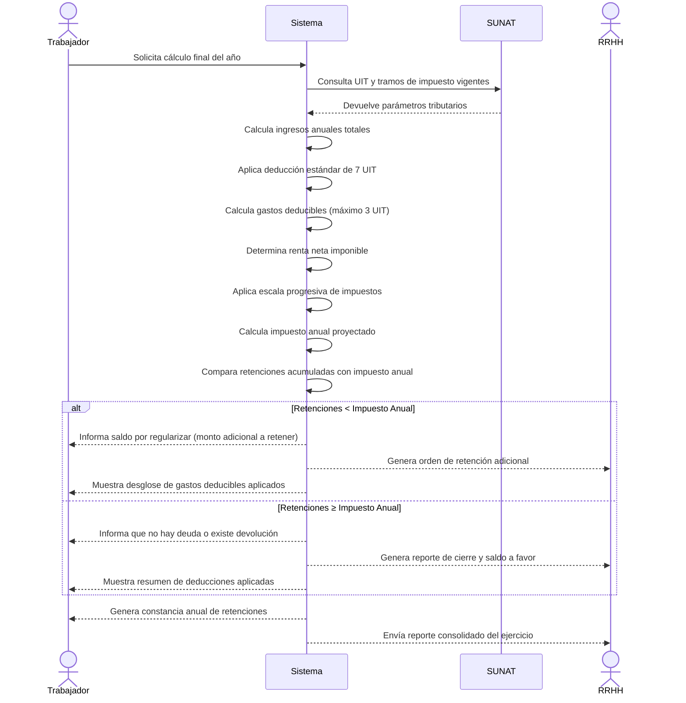

# Diagrama de Secuencia - Cálculo Final del Año

## Descripción del Proceso

### 1. **Solicitud de Cálculo**
- El trabajador solicita el cálculo final del año fiscal
- El sistema inicia el proceso de cálculo integral

### 2. **Consulta de Parámetros SUNAT**
- Sistema consulta UIT vigente (S/ 5,350 para 2025)
- Obtiene tramos de impuesto actualizados
- Verifica tasas progresivas vigentes

### 3. **Cálculo de Ingresos y Deducciones**
- **Ingresos anuales**: Salario base × 12 + ingresos adicionales
- **Deducción 7 UIT**: S/ 37,450 (deducción estándar)
- **Gastos deducibles**: Máximo 3 UIT (S/ 16,050)
  - Restaurantes: 15%
  - Servicios médicos: 30%
  - Servicios profesionales: 30%
  - Alquiler: 30%
  - EsSalud: 100%

### 4. **Determinación de Impuesto**
- Renta neta = Ingresos - 7 UIT - Gastos deducibles
- Aplicación de escala progresiva (8% a 30%)
- Cálculo de impuesto anual proyectado

### 5. **Comparación y Resultado**
- **Saldo por regularizar**: Si retenciones < impuesto anual
- **Saldo a favor**: Si retenciones ≥ impuesto anual
- **Reporte consolidado**: Para RRHH y trabajador

### 6. **Generación de Documentos**
- Constancia anual de retenciones
- Reporte de gastos deducibles aplicados
- Orden de retención adicional (si aplica)
