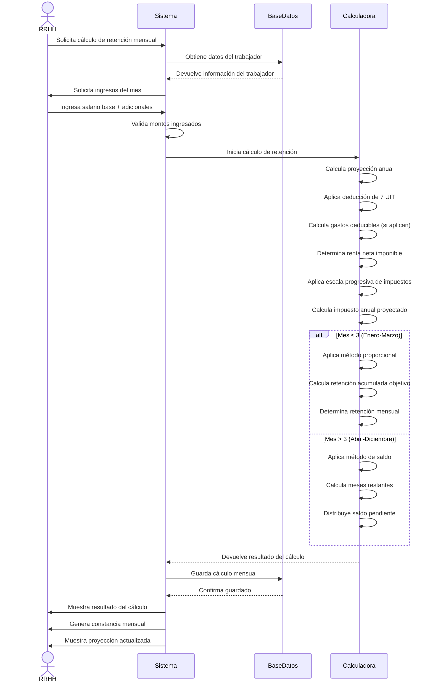

# Diagrama de Secuencia - Cálculo de Retención Mensual

## Descripción del Proceso

### 1. **Solicitud de Cálculo**
- RRHH solicita cálculo para un mes específico
- Sistema recupera datos del trabajador

### 2. **Ingreso de Datos**
- Salario base del mes
- Ingresos adicionales (bonos, comisiones, etc.)
- Gastos deducibles (si aplican)

### 3. **Cálculo de Proyección**
- **Proyección anual**: Salario × 12 + adicionales
- **Deducción 7 UIT**: S/ 37,450
- **Gastos deducibles**: Máximo 3 UIT (S/ 16,050)
- **Renta neta**: Ingresos - 7 UIT - Gastos deducibles

### 4. **Aplicación de Impuestos**
- Escala progresiva (8% a 30%)
- Impuesto anual proyectado
- Comparación con retenciones previas

### 5. **Método de Cálculo Mensual**
- **Enero-Marzo**: Método proporcional
  - Objetivo acumulado = Impuesto × (mes / 12)
  - Retención = Objetivo - Retenciones previas
- **Abril-Diciembre**: Método de saldo
  - Meses restantes = 13 - mes actual
  - Retención mensual = Saldo pendiente / meses restantes

### 6. **Resultado y Documentación**
- Retención mensual calculada
- Constancia mensual generada
- Proyección anual actualizada
- Almacenamiento en base de datos
