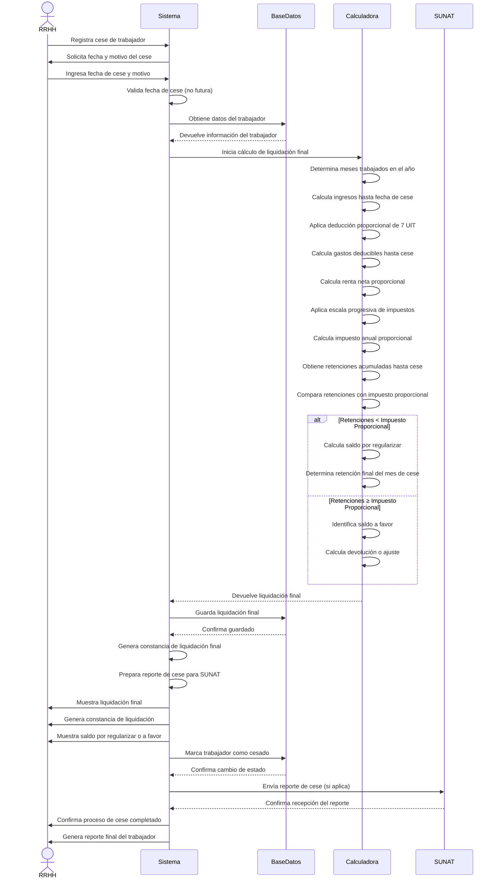

# Diagrama de Secuencia - Cese de Trabajador

## Descripción del Proceso

### 1. **Registro de Cese**
- RRHH registra fecha y motivo del cese
- Sistema valida fecha (no puede ser futura)
- Obtención de datos del trabajador

### 2. **Cálculo de Liquidación Final**
- **Meses trabajados**: Desde enero hasta mes de cese
- **Ingresos proporcionales**: Salario × meses trabajados + adicionales
- **Deducción 7 UIT**: Proporcional a meses trabajados
- **Gastos deducibles**: Acumulados hasta fecha de cese

### 3. **Cálculo de Impuesto Proporcional**
- **Renta neta**: Ingresos proporcionales - 7 UIT proporcional - Gastos deducibles
- **Escala progresiva**: Aplicación de tasas vigentes
- **Impuesto anual**: Proporcional a meses trabajados

### 4. **Comparación Final**
- **Retenciones acumuladas**: Hasta mes de cese
- **Saldo por regularizar**: Si retenciones < impuesto proporcional
- **Saldo a favor**: Si retenciones ≥ impuesto proporcional

### 5. **Liquidación Final**
- **Retención final**: Saldo por regularizar (si aplica)
- **Ajuste de retenciones**: Distribución proporcional
- **Cálculo de devolución**: Saldo a favor (si aplica)

### 6. **Documentación y Reportes**
- **Constancia de liquidación**: Documento oficial del cese
- **Reporte para SUNAT**: Información de cese y liquidación
- **Reporte final**: Resumen completo del trabajador

### 7. **Cambio de Estado**
- Marcado de trabajador como cesado
- Bloqueo de futuras operaciones
- Archivo de datos históricos

### 8. **Consideraciones Importantes**
- **Proporcionalidad**: Todos los cálculos son proporcionales a meses trabajados
- **Retenciones**: Solo se consideran hasta el mes de cese
- **Gastos deducibles**: Acumulados hasta fecha de cese
- **Documentación**: Generación obligatoria de constancia de liquidación
- **SUNAT**: Reporte de cese según normativa vigente
