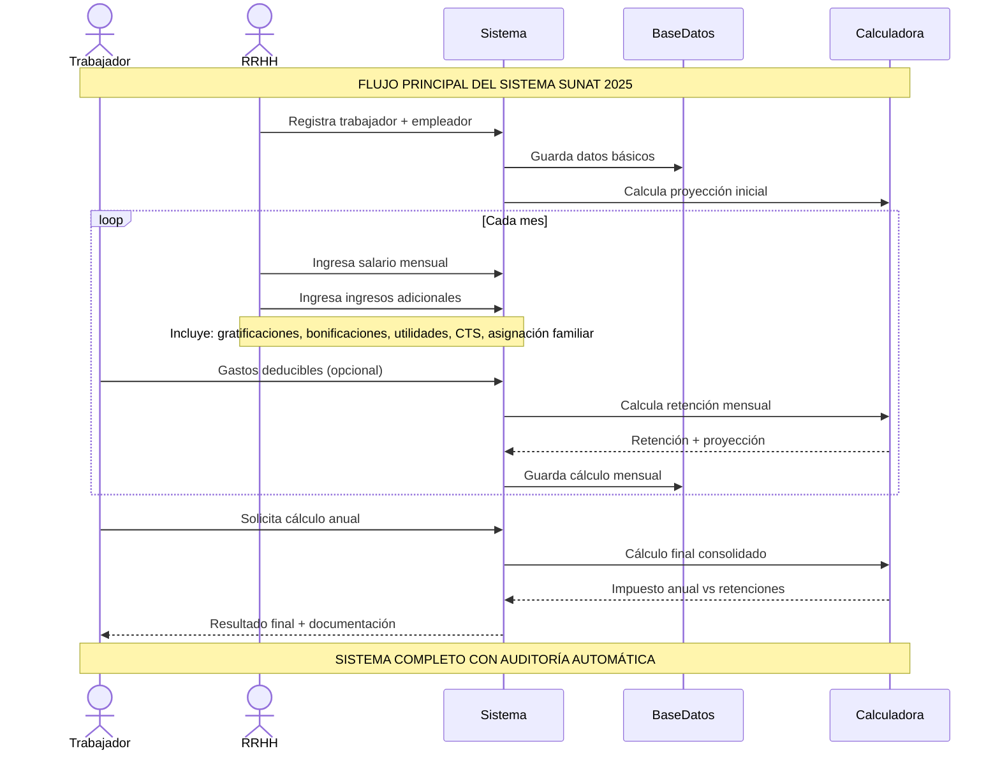

# Diagrama de Secuencia - Flujo Principal del Sistema SUNAT

## Descripción Resumida

### **Flujo Principal**
1. **Registro**: Trabajador + empleador + remuneración base
2. **Mensual**: Salarios + ingresos adicionales + gastos deducibles + retenciones
3. **Final**: Cálculo anual consolidado + resultado

### **Ingresos Adicionales Incluidos**
- **Gratificaciones**: Julio y Diciembre (o mes personalizado)
- **Bonificaciones**: Mes personalizable
- **Utilidades**: Mes personalizable
- **CTS**: Compensación por Tiempo de Servicios (Mayo y Noviembre)
- **Asignación Familiar**: Mensual
- **Ingreso Adicional**: Monto único en mes específico

### **Características Clave**
- **Gastos Deducibles**: Máximo 3 UIT (2025)
- **Métodos**: Proporcional (Enero-Marzo) y Saldo (Abril-Diciembre)
- **Auditoría**: Automática en todos los cambios
- **Documentación**: Constancias mensuales y anuales

### **Componentes**
- **Frontend**: Next.js 14 + TypeScript
- **Backend**: API Routes + Zod + Prisma
- **Base de Datos**: PostgreSQL
- **Testing**: Jest completo

### **Despliegue**
- **Plataforma**: Vercel
- **CI/CD**: Automático
- **Monitoreo**: Logs en tiempo real
