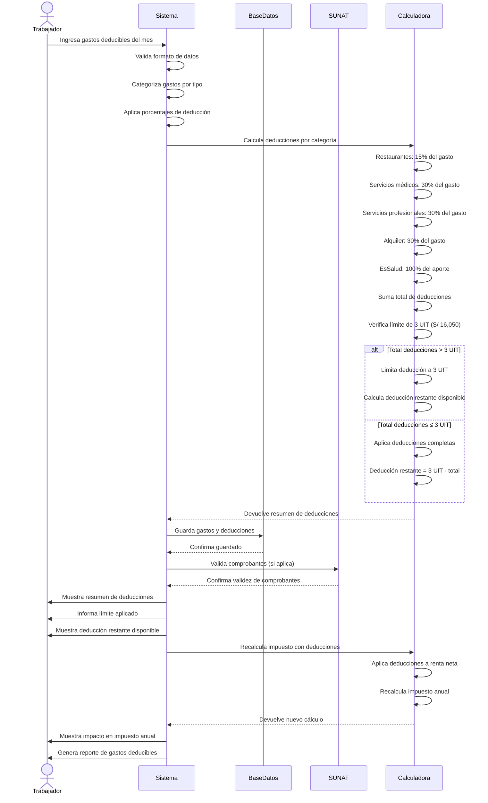

# Diagrama de Secuencia - Gestión de Gastos Deducibles

## Descripción del Proceso

### 1. **Ingreso de Gastos**
- Trabajador ingresa gastos por categoría
- Sistema valida formato y montos
- Categorización automática por tipo

### 2. **Cálculo de Deducciones**
- **Restaurantes, bares y hoteles**: 15%
- **Servicios médicos y odontológicos**: 30%
- **Servicios profesionales y oficios**: 30%
- **Alquiler de inmuebles**: 30%
- **Aportaciones a EsSalud**: 100%

### 3. **Aplicación de Límites**
- **Límite máximo**: 3 UIT (S/ 16,050)
- **Verificación**: Total deducciones ≤ 3 UIT
- **Ajuste**: Si excede, se limita al máximo

### 4. **Validación de Comprobantes**
- Verificación con SUNAT
- Validación de estado habido del emisor
- Confirmación de actividad económica

### 5. **Recálculo de Impuestos**
- Aplicación de deducciones a renta neta
- Recalculación de impuesto anual
- Actualización de proyecciones

### 6. **Resultado y Documentación**
- Resumen de deducciones aplicadas
- Impacto en impuesto anual
- Reporte de gastos deducibles
- Deducción restante disponible

### 7. **Restricciones Importantes**
- Solo aplica si ingresos > 7 UIT (S/ 37,450)
- Comprobantes válidos obligatorios
- Medios de pago electrónicos para montos ≥ S/ 2,000
- Vigencia hasta 31 de diciembre de 2025
