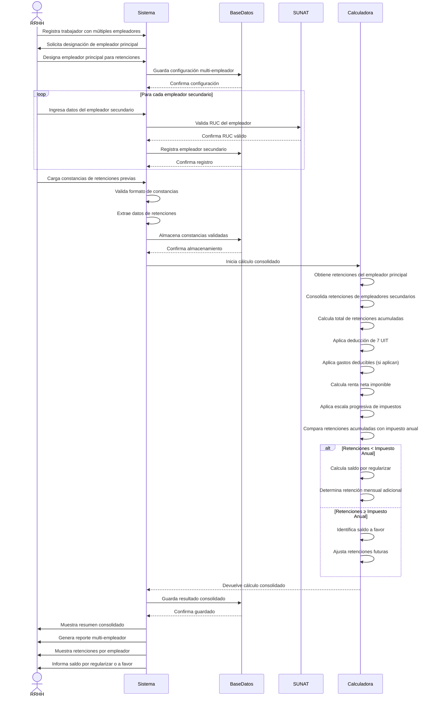

# Diagrama de Secuencia - Escenario Multi-Empleador

## Descripción del Proceso

### 1. **Configuración Multi-Empleador**
- Registro de trabajador con múltiples empleadores
- Designación de empleador principal para retenciones
- Validación de RUC de cada empleador

### 2. **Gestión de Empleadores Secundarios**
- Registro de cada empleador secundario
- Validación de estado habido con SUNAT
- Almacenamiento de relaciones laborales

### 3. **Carga de Constancias**
- Ingreso de constancias de retenciones previas
- Validación de formato y contenido
- Extracción de datos de retenciones

### 4. **Cálculo Consolidado**
- **Retenciones del empleador principal**: Cálculo mensual
- **Retenciones de empleadores secundarios**: Consolidación de constancias
- **Total acumulado**: Suma de todas las retenciones

### 5. **Aplicación de Deducciones**
- Deducción estándar de 7 UIT (S/ 37,450)
- Gastos deducibles (máximo 3 UIT)
- Renta neta imponible consolidada

### 6. **Comparación y Resultado**
- **Saldo por regularizar**: Si retenciones < impuesto anual
- **Saldo a favor**: Si retenciones ≥ impuesto anual
- **Ajuste de retenciones**: Distribución en meses restantes

### 7. **Reporte Consolidado**
- Resumen de retenciones por empleador
- Total consolidado del ejercicio
- Saldo por regularizar o a favor
- Recomendaciones de retención adicional

### 8. **Consideraciones Importantes**
- Solo un empleador puede retener impuestos
- Constancias deben ser válidas y vigentes
- Consolidación automática de retenciones previas
- Cálculo proporcional de saldos pendientes
