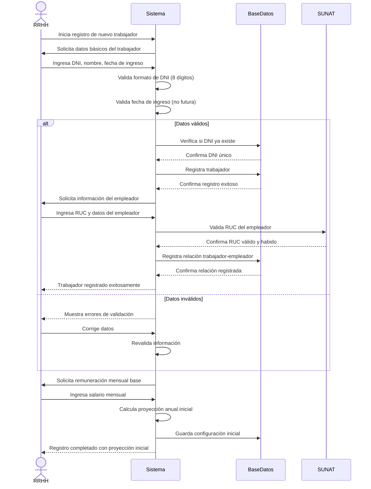

# Diagrama de Secuencia - Registro de Trabajador

## Descripción del Proceso

### 1. **Inicio del Registro**
- RRHH inicia el proceso de registro
- Sistema solicita datos obligatorios del trabajador

### 2. **Validación de Datos**
- **DNI**: Formato de 8 dígitos, verificación de unicidad
- **Nombre**: Validación de caracteres válidos
- **Fecha de ingreso**: No puede ser futura

### 3. **Registro en Base de Datos**
- Verificación de DNI único
- Almacenamiento de datos del trabajador
- Creación de registro principal

### 4. **Asignación de Empleador**
- Ingreso de RUC del empleador
- Validación con SUNAT (estado habido)
- Registro de relación laboral

### 5. **Configuración Inicial**
- Definición de remuneración base
- Cálculo de proyección anual inicial
- Almacenamiento de configuración

### 6. **Confirmación**
- Registro exitoso del trabajador
- Proyección fiscal inicial calculada
- Sistema listo para cálculos mensuales
